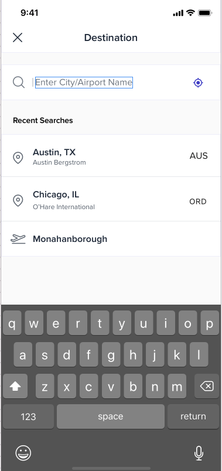

# Build a airport search and results screen for airport lookup 

### You are provided with the design images below.

* Flight Search screen 


* Flight Search results screen 



* Your goal is to build these two screens in react native.
* To get the airport city and codes please use the following API
```
https://www.cleartrip.com/places/airports/search?string=
```

### Expected flow
Flight Search Screeen -> Click From -> Flight Search results screen -> Enter First 3 letters of the city/airport 
-> Show results -> Select one result -> Go back to FLights Home -> Display the selected airport code

### General guidelines
* Use react-native to code.
* Please follow RN coding conventions
* The assumed time for completing this is something in the range of 2-3 hours.
* Can be done in one or more sittings.
* Should run on iOS or Android

### How to submit results
* Create a github repo and send a link to pradeepdotbanavaraatepicdotone


